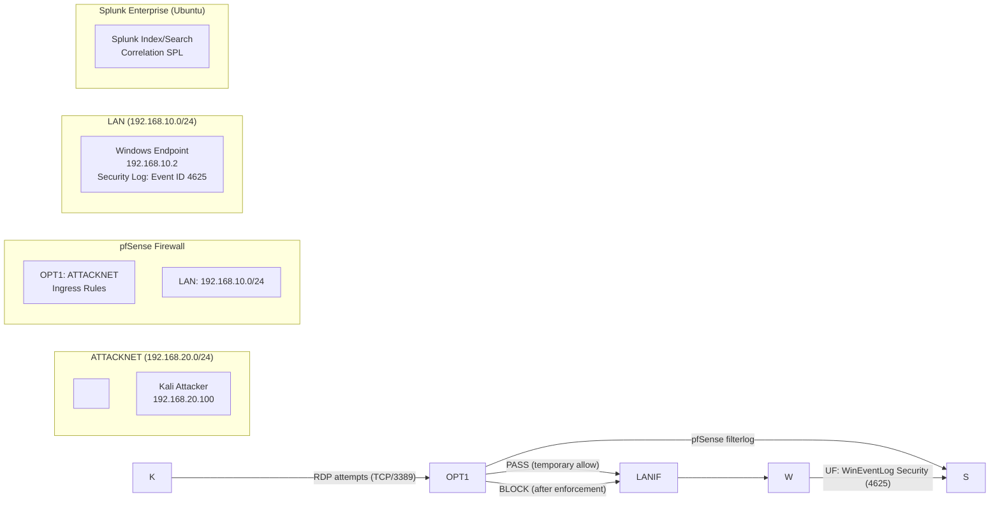

\# pfsense-to-splunk-rdp-segmentation-detection

Status: Completed  

Security Control Validated: Network Segmentation (ATTACKNET → LAN)  

Detection Type: Cross-layer Correlation (Firewall + Endpoint)  

Mapped Techniques: T1110, T1021.001  

---

\*\*Phase 2 — Experiment 1 | Network Segmentation Validation + RDP Attack Telemetry Correlation (pfSense + Windows + Splunk)\*\*

---

\## Executive Summary

This experiment validates network segmentation enforcement and detection engineering correlation within a Blue Team home lab environment. A Kali attacker system (ATTACKNET) generated failed RDP authentication attempts against a Windows endpoint (LAN). Telemetry was captured at two layers:

\- \*\*Network layer:\*\* pfSense firewall filterlog  

\- \*\*Endpoint layer:\*\* Windows Security Event ID 4625  

Both data sources were ingested into \*\*Splunk Enterprise\*\* for centralized analysis.

The experiment confirmed that RDP traffic was temporarily allowed for controlled testing, enabling measurable attack telemetry. A blanket allow rule on the OPT1 interface was then identified and removed to restore proper segmentation. After enforcement, pfSense logged \*\*BLOCK\*\* events for TCP/3389 and Windows no longer generated new 4625 failures from the attacker source.

This demonstrates both prevention and visibility across security layers.

---

\## What This Proves

\- \*\*Segmentation enforcement works:\*\* ATTACKNET → LAN traffic is blocked by policy (pfSense BLOCK on TCP/3389).

\- \*\*Controlled exception testing is measurable:\*\* Temporary RDP allowance produces correlated firewall and endpoint telemetry.

\- \*\*Cross-layer correlation strengthens detection:\*\* Firewall PASS/BLOCK events align with Windows authentication failures (Event ID 4625).

\- \*\*Configuration weaknesses are detectable:\*\* An unintended blanket allow rule on OPT1 was discovered and removed, restoring intended security posture.

\- \*\*Security controls can be validated through telemetry:\*\* Enforcement was verified by observing BLOCK events and the absence of new 4625 failures post-remediation.

---

\## Lab Architecture

\### Network Segments

\- \*\*LAN:\*\* `192.168.10.0/24`  

&nbsp; - Windows endpoint: `192.168.10.2`

\- \*\*ATTACKNET (OPT1):\*\* `192.168.20.0/24`  

&nbsp; - Kali attacker: `192.168.20.100`

\### Stack

\- \*\*pfSense Firewall\*\* (WAN / LAN / OPT1-ATTACKNET)

\- \*\*Splunk Enterprise on Ubuntu\*\*

\- \*\*Windows Endpoint\*\* with Splunk Universal Forwarder

\- \*\*Kali Linux Attacker VM\*\*

---

\## Diagram (Mermaid)

---

\## Technical Validation

\### 1. Temporary Policy Adjustment

Enabled ATTACKNET → LAN RDP (TCP/3389) for controlled testing.

\#### pfSense Temporary Allow Rule

!\[pfSense Temporary Allow Rule](screenshots/pfsense/pfsense-opt1-temp-allow-3389.png)

\#### pfSense PASS Filterlog Entries

!\[pfSense PASS Filterlog](screenshots/pfsense/pfsense-filterlog-pass-3389.png)

---

\### 2. Attack Simulation

Generated failed RDP logon attempts from Kali.

\#### Windows Event Viewer — Event ID 4625

!\[Windows 4625 Event](screenshots/windows/windows-security-4625-eventviewer.png)

\#### Splunk — 4625 Ingestion Confirmed

!\[Splunk 4625 Ingestion](screenshots/splunk/splunk-4625-ingestion-confirmed.png)

---

\### 3. Cross-Layer Correlation

Confirmed alignment between firewall PASS events and Windows 4625 failures in Splunk.

\#### Splunk — pfSense PASS (Parsed)

!\[Splunk pfSense PASS](screenshots/splunk/splunk-pfsense-pass-3389.png)

---

\### 4. Segmentation Restoration

Identified and removed unintended blanket allow rule on OPT1.

\#### pfSense BLOCK Filterlog Entries

!\[pfSense BLOCK Filterlog](screenshots/pfsense/pfsense-filterlog-block-3389.png)

\#### Splunk — pfSense BLOCK (Parsed)

!\[Splunk pfSense BLOCK](screenshots/splunk/splunk-pfsense-block-3389.png)

\#### Splunk — Post-Enforcement No New 4625

!\[Splunk No New 4625](screenshots/splunk/splunk-post-enforcement-no-4625.png)

---

\## Field Normalization Note

pfSense firewall logs were ingested as generic syslog (`sourcetype=syslog`) without automatic field extraction. To enable structured analysis within Splunk, inline parsing was performed using SPL (`rex`, `split`, and `mvindex`) to extract key fields such as `action`, `src\_ip`, `dest\_ip`, and `dest\_port` from the filterlog CSV format.

This demonstrates the ability to normalize raw log data for detection engineering without relying on prebuilt technology add-ons — reflecting real-world SOC workflows where log formats must often be interpreted and structured manually.

---

\## MITRE ATT\&CK Mapping

\- \*\*T1110 — Brute Force\*\*  

&nbsp; Repeated authentication attempts against a remote service (RDP).

\- \*\*T1021.001 — Remote Services: Remote Desktop Protocol\*\*  

&nbsp; Represents the targeted access vector (RDP over TCP/3389).

Within this experiment:

\- \*\*T1021.001\*\* = Access vector  

\- \*\*T1110\*\* = Authentication abuse method  

---

\## Lessons Learned

\- Firewall rule hygiene is critical; a single unintended allow rule can undermine segmentation objectives.

\- Cross-layer telemetry provides stronger validation than single-source logging.

\- Temporary policy adjustments enable measurable security testing when carefully controlled.

\- Field normalization is often necessary when ingesting raw syslog data.

\- Prevention and detection should be validated together, not independently.

---

\## Professional Closeout

Phase 2 — Experiment 1 demonstrates that network segmentation can be validated, monitored, and proven using correlated telemetry across firewall and endpoint layers.

By introducing controlled attack traffic, capturing multi-layer logs, correlating evidence in Splunk, and restoring enforcement, this experiment establishes a repeatable detection engineering workflow:

\*\*Introduce → Observe → Correlate → Enforce → Verify\*\*

This structured approach reflects practical defensive security methodology and forms the foundation for more advanced authentication abuse detection in subsequent phases.

